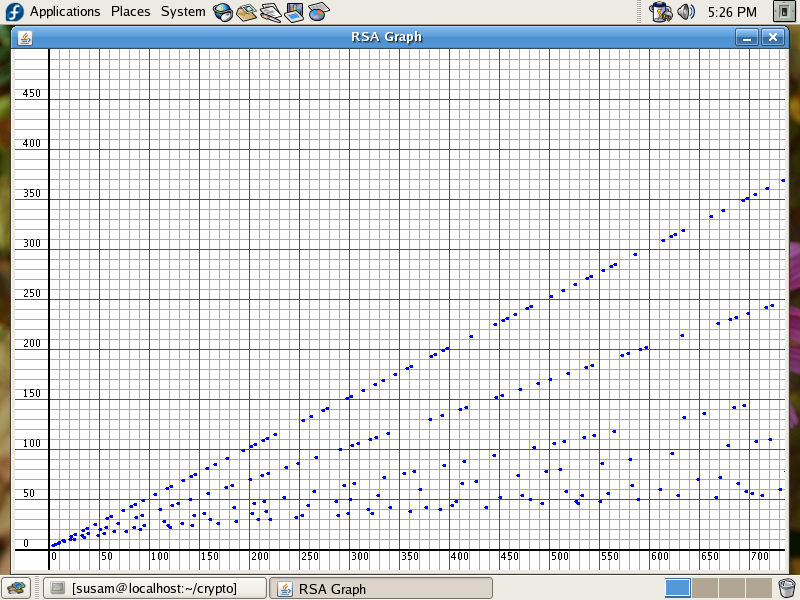

Plot of p + q vs. pq for primes p and q
=======================================
The Java program, [RSAGraph.java][JAVA], in this directory plots the sum
of two primes (p + q) on y-axis against their product (pq) on x-axis,
for all pairs of prime numbers (p, q) that fit within the graph display.

The image, [RSAGraph.png][PNG], in this directory is a screenshot of the
graphical output by the Java program.

I happened to find this 11 year old screenshot and the code while
browsing my old files. The code and the screenshot were created in the
year 2007. I have preserved these artifacts as a Git repo primarily for
nostalgic reasons.

[JAVA]: RSAGraph.java
[PNG]: RSAGraph.png

Contents
--------
* [Graph](#graph)
* [Streaks](#streaks)
* [Quirks](#quirks)

Graph
-----

Streaks
-------
An interesting pattern that seems to emerge in this graphical plot are
the streaks of blue dots: points that appear to form straight lines of
various slopes. At least three such streaks are quite conspicuous.
Although this may seem mysterious at first, this mystery can be
dispelled quite easily with a closer examination.

A closer look at the graph shows that the three clearly visible streaks
appear to have slopes of about 1/2, 1/3, and 1/5, respectively.

The first streak of blue dots consists of points (p + q, pq) for primes
q such that p = 2. This is a streak of points (2 + q, 2q) for primes q.
Thus the approximate slope of this streak is 2 + q / 2q which is
approximately equal to 1/2 for large values of q.

Similarly the second streak of blue dots consists of points (3 + q, 3q)
for primes q. The approximate slope of this streak is 1/3 approximately
for large values of q.

Quirks
------
There are a few quirks in the screenshot that caught my attention:

  - The image size of the screenshot is 800x600 pixels. This is due to
    the fact that the desktop display on which I took this screenshot
    had a resolution of 800x600 pixels. Right now, I am looking at a
    display which has more than 10 times that many pixels as I write
    this README file.

  - I chose to plot the graph using Java with its Swing and AWT API,
    although I knew how to plot graphs using Octave as well as
    Matplotlib at that time. Perhaps I was more comfortable writing code
    in Java back then. These days, I usually choose Python and/or
    Matplotlib for such quick and dirty hacks.

  - The screenshot shows a Fedora Linux system. This is quite odd to me
    because I have almost always used and I still use Debian as my
    primary Linux distribution. I cannot remember the circumstances that
    led me to take this screenshot on a Fedora system.
